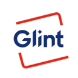
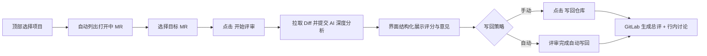

<p align="center">
  
</p>

<h1 align="center">Glint</h1>

<p align="center">
  <strong>专为开发者打造的 GitLab Merge Request 智能 AI 代码评审桌面客户端</strong>
</p>

<p align="center">
  
  
  
  
  
  
  
  
</p>

---

## 📖 为什么选择 Glint？

在研发流程中，代码审查（Code Review）是保障系统质量与安全的关键防线。然而传统的评审方案往往面临以下困境：

* ❌ **CI/CD Pipeline 脚本方案**：需要在每个仓库维护 `.gitlab-ci.yml`，每次提交都全量跑一次 AI，浪费大量 Token，且难以按需交互；
* ❌ **GitLab Webhook + 机器人服务**：必须搭建并长期运维中心化 Webhook 接收服务，在内网或自托管 GitLab 场景下打通公网或内网映射难度大，且存在集中式泄露 Access Token 的安全风险；
* ❌ **网页端复制粘贴**：把几千行 Diff 手动拷给 ChatGPT/DeepSeek，再把建议复制回 GitLab，费时费力。

### 💡 Glint 的解决之道：零侵入独立桌面客户端

**Glint** 采用轻量化原生桌面形态，开箱即用：
- **零侵入**：不需要在 GitLab 仓库配置任何 Webhook、CI 脚本或安装第三方应用；
- **私密安全**：GitLab Token 与 AI Key 仅安全存储于本地设备，请求直连 GitLab 与 AI 服务商，不经过任何第三方中转；
- **按需审查**：打开应用，选择项目与目标 MR，点击即可开始深度审查；
- **精准行内写回**：审查结果不仅可以在本地清晰预览，还支持一键以**真实的 GitLab 行内讨论（Inline Discussions）**精准定位到具体文件的具体代码行，被审查人可直接在 GitLab 上针对该行讨论或点击“Resolve thread”。

---

## ✨ 核心特性矩阵

| 特性 | 说明 |
| :--- | :--- |
| ⚡ **极致轻量 (~3.1 MB)** | 基于 **Tauri 2 + Rust**，无任何 Electron 运行时冗余，启动秒开，常驻内存仅数十 MB。 |
| 🔍 **项目实时检索** | 自动拉取当前账号在 GitLab 拥有权限的所有项目，支持拼音/英文实时模糊搜索与一键清空。 |
| 🤖 **兼容所有 OpenAI-Compatible 模型** | 支持 DeepSeek、GPT-4o、Claude、Kimi、阿里通义千问、火山引擎豆包，以及**本地私有化 Ollama** 等。 |
| 🛡️ **多维度代码深度审视** | 针对变更行（Diffs）覆盖：逻辑缺陷、边界条件、并发安全、SQL/XSS 注入、内存/资源泄露、代码坏味道。 |
| 💬 **真·行内评论写回** | 自动计算 Git Diff 新旧代码行号，调用 GitLab Discussions API 精准挂载行内评审意见。 |
| ⚙️ **灵活的写回模式** | 支持「评审后自动写回」、「手动写回」，以及「仅写总体总结，不挂行内评论」等多种偏好。 |
| 🧩 **自定义技能扩展 (Skills)** | 支持挂载外部技能目录，通过 Markdown 编写业务线专属的评审规则（如架构规范、统一错误码等）。 |
| 🌓 **双主题与细腻动效** | 原生跟随系统深色（Dark）/浅色（Light）模式，沉浸式极简无干扰体验。 |
| 🔄 **内置版本检查** | 侧边栏支持一键检测 GitHub Release 最新版本，升级信息随时掌握。 |

---

## 📦 下载与安装

前往 [GitHub Releases 最新发布页](https://github.com/HongSphere/Glint/releases/latest) 下载适配你操作系统的安装包：

| 操作系统 | 架构 | 文件类型 | 文件名 | 说明 |
| :--- | :--- | :--- | :--- | :--- |
| **macOS** | Apple Silicon (M1/M2/M3/M4) | DMG 镜像 | `Glint_0.1.0_aarch64.dmg` | 推荐，双击打开后拖入 Applications |
| **macOS** | Apple Silicon (M1/M2/M3/M4) | ZIP 免安装 | `Glint_0.1.0_aarch64_mac.zip` | 解压后直接运行 `Glint.app` |
| **Windows** | x64 (64-bit) | NSIS 一键安装包 | `Glint_0.1.0_x64-setup.exe` | 运行安装向导快速安装 |

> 💡 **提示**：macOS Intel (x86_64) 或 Linux 用户可拉取源码自行构建（参见下文 [本地开发与构建](#-本地开发与构建)）。

---

### 🍎 macOS 首次运行提示“已损坏”或“无法打开”？

由于个人开源项目尚未采购昂贵的 Apple 开发者签名证书，从浏览器下载未公证的应用时，macOS Gatekeeper 会自动打上隔离标记（`com.apple.quarantine`），并可能弹出警告：
> *“Glint”已损坏，无法打开。你应该将它移到废纸篓。*

**无需移到废纸篓，只需一条命令即可解除隔离：**

1. 打开 macOS **终端（Terminal）**；
2. 复制并执行以下命令（若已拖入“应用程序”）：
   ```bash
   xattr -dr com.apple.quarantine /Applications/Glint.app
   ```
3. 重新双击打开 Glint 即可顺利启动。

*(也可以前往 macOS **「系统设置」→「隐私与安全性」**，下拉至安全性部分，点击 **“仍要打开”**)*

---

### 🪟 Windows 首次运行提示 SmartScreen 筛选拦截？

如果在 Windows 启动时弹出“Windows 已保护你的电脑”（SmartScreen 提示未知发布者）：
- 点击窗口上的 **「更多信息」**；
- 点击右下角的 **「仍要运行」** 即可。

---

## 🚀 快速上手（3 分钟配置）

首次启动 Glint 后，点击左侧导航栏的 **「设置」** 进行必要配置：

```
[ Glint 设置中心 ]
  ├── 1. GitLab 服务配置 (Host + Access Token) ──> [测试 GitLab 连接]
  ├── 2. AI 大模型配置 (Base URL + Key + Model) ──> [测试 AI 连接]
  └── 3. 评审技能与外观主题偏好
```

### 1. GitLab 连通配置

* **GitLab 主机**：
  * 若使用 GitLab 官方公网：填 `gitlab.com`；
  * 若使用企业私有化部署实例（CE/EE）：填 `gitlab.yourcompany.com`（支持带或不带 `https://`，支持自定义端口如 `gitlab.local:8080`）；
* **Access Token**：
  * 登录你的 GitLab，点击右上角头像 → **Preferences** → **Access Tokens**（或项目中的 Project Access Tokens）；
  * 新建 Token，名称填 `Glint-Review`；
  * **权限勾选说明**：
    * **`api`**（推荐）：允许读取项目与 MR，并在评审后向 MR 自动发表总结及创建行内讨论（Inline Discussions）；
    * **`read_api`**：若仅希望本地预览评审结果、不向 GitLab 写回任何评论，可仅勾选此项；
* 填好后点击 **「测试 GitLab 连接」**，显示验证通过即可。

### 2. AI 接口配置（OpenAI 兼容规范）

Glint 后端支持所有兼容 OpenAI API 规范的大模型服务。以下是常用服务的配置速查：

| 大模型服务商 | Base URL | 推荐模型名称 | 说明 |
| :--- | :--- | :--- | :--- |
| **DeepSeek (深度求索)** | `https://api.deepseek.com/v1` | `deepseek-chat` 或 `deepseek-coder` | 强烈推荐！代码审查性价比与效果极佳 |
| **OpenAI** | `https://api.openai.com/v1` | `gpt-4o` 或 `gpt-4o-mini` | 原生通用强大模型 |
| **阿里通义千问 (百炼)** | `https://dashscope.aliyuncs.com/compatible-mode/v1` | `qwen-plus` 或 `qwen2.5-coder-32b-instruct` | 编程专项模型表现优异 |
| **火山引擎 (豆包/Ark)** | `https://ark.cn-beijing.volces.com/api/coding/v3` | 对应推理接入点 ID (如 `ep-xxxx`) | 适合火山引擎企业开发者 |
| **Moonshot (Kimi)** | `https://api.moonshot.cn/v1` | `moonshot-v1-32k` | 超长上下文支持 |
| **本地私有化 Ollama** | `http://localhost:11434/v1` | `qwen2.5-coder:14b` / `deepseek-r1:14b` | **企业代码不上云首选！** API Key 随意填 `ollama` 即可 |

填入对应的 Base URL、API Key 与模型名称后，点击 **「测试 AI 连接」**，确认模型通信正常。

### 3. 保存配置

点击设置页底部的 **「保存」** 按钮。所有配置将保存在本机应用安全目录中，**永不上报任何云端**。

---

## 🔄 完整使用流转



1. **项目加载与切换**：
   - 切换到「评审」视图，在顶部项目搜索栏点击刷新图标，即可加载全部可见 GitLab 项目；
   - 键盘输入名称支持毫秒级模糊搜索，回车或鼠标点击即可选定项目。
2. **选择待审 MR**：
   - 左侧面板自动列出该项目所有状态为 `opened` 的 Merge Request（附带作者、源分支、目标分支及 IID）；
   - 支持通过顶部搜索框按标题或分支过滤。
3. **发起审查**：
   - 选中 MR 后，右侧面板展示基本信息，下方 **「开始评审」** 按钮激活；
   - 点击开始评审后，进度条实时显示当前分析状态。
4. **审查结果与写回**：
   - 审查完成后呈现评分（0 - 100 分）、评审结论（通过 / 需修改 / 建议）、亮点表扬与缺陷清单；
   - **自动写回（Auto-Post）**：若勾选「评审后自动写回」，分析完毕后无需二次干预直接同步；
   - **精准行内写回**：GitLab 界面上对应代码行将自动出现该讨论线程，被审查者可直接在此回复或勾选 Resolve 标记已解决。

---

## 🧩 自定义技能扩展（Custom Skills）

Glint 创新性地引入了 **Skill（技能）** 体系。通过对系统提示词（System Prompt）进行规则注入，你可以为不同团队或项目量身打造专属的审查准则。

### 目录结构要求

在电脑任意位置创建一个技能根目录（如 `~/glint-skills`），然后在其中为每个技能建立独立文件夹与 `SKILL.md`：

```
~/glint-skills/
├── backend-java-rules/
│   └── SKILL.md
└── frontend-react-rules/
    └── SKILL.md
```

### 编写规范示例 (`SKILL.md`)

`SKILL.md` 包含 YAML Frontmatter 元信息以及正文规则：

```markdown
---
name: backend-java-rules
description: 针对团队 Java/Spring Boot 核心业务的专属代码规范审查
---

# Java 业务线特定代码审查规则

你是一位严谨的资深 Java 架构师。在审查该 MR 时，除了通用代码逻辑外，请重点强化以下检查：

1. **数据库与事务安全**：
   - 检查 `@Transactional` 是否加在非 public 方法或被同类自调用导致事务失效；
   - 检查是否存在循环调用 SQL / Mapper（N+1 查询问题）；
   - SQL 语句中禁止出现未经转义的动态拼接。

2. **异常与返回规范**：
   - 控制层必须统一返回 `Result<T>` 封装体；
   - 严禁空 catch 块吞掉异常，关键操作必须有日志埋点（避免打印敏感入参如密码、身份证）。

3. **并发与资源释放**：
   - 自定义线程池必须指定有界队列与拒绝策略；
   - IO 流、HttpClient 必须保证在 `try-with-resources` 中关闭。

输出要求：请始终保持专业、客观、全中文输出。
```

### 挂载到应用

1. 打开 Glint **「设置」** → **「评审」** 区域；
2. 在“自定义技能目录”中点击 **「选择目录」**，选中你的技能文件夹；
3. 上方的“AI 评审技能”下拉框将立即列出所有识别出的技能，选择你的定制技能并保存即可生效！

---

## ❓ 常见问题（FAQ）

### Q1: 测试 GitLab 连接时提示 401 Unauthorized？
* **原因**：填写的 Access Token 无效、已过期，或者 Token 被撤销；
* **解决**：在 GitLab 重新生成一个新的 Personal Access Token，确保未过期，并赋予 `api` 权限。

### Q2: 提示 404 Not Found 或无法获取项目列表？
* **原因 1**：GitLab 主机地址填写有误（例如多了多余的路径或斜杠）；
* **原因 2**：Token 属于受限账户，在私有部署中对目标 Group / Project 没有 Reporter 以上的读取权限。

### Q3: 为什么有些修改行没有出现行内评论？
* Glint 在向 GitLab 挂载讨论时，会严格根据 Git Diff 计算有效变更行（`new_line` 或 `old_line`）；
* 仅当 AI 明确指出具体缺陷代码、且该行落在当前 MR 的变更片段内时，GitLab API 才会接受挂载；对于属于整体架构或非变更行的问题，Glint 会将其统一汇总在 MR 总体评论中。

### Q4: 如何在离线或内网环境下使用本地私有化大模型？
* 安装 [Ollama](https://ollama.com/)；
* 终端运行适合代码审查的模型（如 `ollama run qwen2.5-coder:14b` 或 `deepseek-r1:14b`）；
* 在 Glint 设置中配置：
  * **Base URL**：`http://localhost:11434/v1`
  * **API Key**：`ollama`（Ollama 不需要鉴权，但需填入占位符满足 OpenAI 协议规范）
  * **模型**：`qwen2.5-coder:14b`
* 这样所有的代码 Diff 仅在本地回环地址传输，100% 保证源码不流出内网。

---

## 🛠️ 本地开发与构建

### 1. 环境准备

* [Node.js](https://nodejs.org/) (>= 20.0.0)
* [Rust & Cargo](https://rustup.rs/) (>= 1.75.0)
* 平台编译工具链：
  * **macOS**：`xcode-select --install`
  * **Windows**：Visual Studio 2022 C++ 桌面开发工作负载（Build Tools）
  * **Linux**：`sudo apt-get install libwebkit2gtk-4.1-dev build-essential curl wget file libxdo-dev libssl-dev libayatana-appindicator3-dev librsvg2-dev`

### 2. 启动本地开发

```bash
# 安装前端依赖
npm install

# 启动桌面端热重载开发环境
npm run dev
```

### 3. 本地构建打包

```bash
# macOS 打包（输出 .app 与 .dmg）
npm run tauri build -- --bundles app,dmg

# Windows 打包（输出 .exe 安装包）
npm run tauri build -- --bundles nsis
```

打包产物生成在：`src-tauri/target/release/bundle/`

### 4. 自动化 CI 发布（GitHub Actions）

本项目配置了基于 GitHub Actions 的全自动化发布流水线 [`.github/workflows/release.yml`](.github/workflows/release.yml)。
当你为代码打上版本 Tag 并推送时：
```bash
git tag v0.1.0
git push origin v0.1.0
```
GitHub Actions 会自动在云端分别启动 **macOS** 与 **Windows** 虚拟机矩阵，同步编译原生二进制文件、生成应用图标、构建安装包，并自动将产物上传至 GitHub Releases。

---

## 📁 项目架构

```
Glint/
├── ui/                        # 前端界面（Vanilla HTML/CSS/JS，极简轻量，零构建负担）
│   ├── index.html             # 应用 DOM 视图结构（评审、设置、关于）
│   ├── styles.css             # 现代化设计系统与深浅色主题样式
│   ├── app.js                 # 核心交互、MR 列表过滤、状态流转
│   ├── api.js                 # Tauri 2 invoke 原生 IPC 封装
│   └── icon.png               # 应用界面内嵌 Logo
├── src-tauri/                 # Rust 核心引擎
│   ├── Cargo.toml             # Rust 依赖声明
│   ├── tauri.conf.json        # Tauri 2 窗口、打包与跨平台图标配置
│   ├── icons/                 # 全尺寸高清跨平台应用图标（.icns, .ico, 32-512px .png）
│   ├── skills/                # 内置默认评审提示词技能
│   │   └── gitlab-mr-review/  # 默认通用审查技能模版 (SKILL.md)
│   └── src/
│       ├── main.rs            # 应用程序执行主入口
│       ├── lib.rs             # Tauri 插件注册与命令分发
│       ├── gitlab.rs          # GitLab REST API 客户端（项目、MR、Diff、Discussions）
│       ├── review.rs          # AI 提示词拼装、结构化 JSON 解析与审查执行器
│       ├── config.rs          # 本地配置加密读写与持久化
│       └── skills.rs          # 技能扫描与加载解析引擎
├── .github/                   # GitHub Actions 跨平台 CI 构建流水线
├── LICENSE                    # MIT 开源授权协议
└── README.md                  # 项目详细说明文档
```

---

## 🤝 参与贡献

热烈欢迎任何形式的贡献！
* 如果你发现了 Bug 或有新功能想法，请随时提交 [Issue](https://github.com/HongSphere/Glint/issues)；
* 如果你想贡献代码，请 Fork 仓库并创建分支，提交 Pull Request 即可；
* 欢迎为 Glint 编写并分享更多针对不同语言/框架的内置评审技能。

---

## 📄 开源许可

Glint 遵循 [MIT License](LICENSE) 许可开源。
你可以自由地在个人或商业项目中免费使用、分发与修改。
