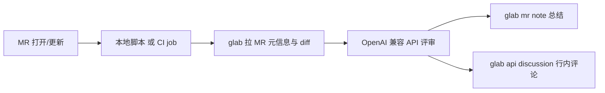

# GitLab MR AI 评审

两套方案，可按场景选用：

| 方案 | 形态 | 触发 | 更新 |
|------|------|------|------|
| **桌面端 Glint** | Electron App（macOS / Windows） | 图形界面选 MR 一键评审 | GitHub Releases 自动更新（`HongSphere/Glint`） |
| **CLI + CI** | Python 脚本 + glab | 本地命令或 MR 流水线 | 随仓库代码更新 |

## 桌面端（推荐给个人日常）

```bash
cd desktop
npm install
npm start
```

详细说明、打包与发版见 [`desktop/README.md`](desktop/README.md)。

更新源：https://github.com/HongSphere/Glint

---

## CLI + CI（glab 路径）

在自建 GitLab 上，用 `glab` 拉 MR diff，调用任意 OpenAI 兼容模型做评审，再把 **行内评论 + 总结贴** 回写到 MR。

支持两种触发方式：

1. **本地手动**：`./scripts/review-local.sh`
2. **CI 自动**：MR 打开/更新时由 `.gitlab-ci.yml` 跑

## 架构



## 一次性准备

### 1. 安装并登录 glab

```bash
brew install glab   # 本机已有 1.117.0
glab auth login --hostname gitlab.your-company.com
```

CI 中用 Project/Group Access Token（scope: `api`）写入变量 `GITLAB_TOKEN`。

### 2. 配置 AI 接口

复制环境变量模板：

```bash
cp .env.example .env
```

按你的网关改：

| 变量 | 说明 |
|------|------|
| `AI_BASE_URL` | OpenAI 兼容 base，如 `https://api.deepseek.com/v1` |
| `AI_API_KEY` | API Key |
| `AI_MODEL` | 模型名，如 `gpt-4o-mini` / `deepseek-chat` |

CI 中把同样三项加到 **Settings → CI/CD → Variables**（勾选 Masked）。

### 3. 接入仓库

把本目录的这些文件拷进你的业务仓库根目录：

```
scripts/ai_review.py
scripts/review-local.sh
.gitlab-ci.yml
.env.example          # 本地用；CI 用 Variables，不要提交 .env
```

```bash
chmod +x scripts/review-local.sh
git add scripts .gitlab-ci.yml .env.example
git commit -m "ci: add AI MR review"
```

若仓库已有 `.gitlab-ci.yml`，只需把 `ai-mr-review` 这个 job 和 `review` stage 合并进去。

## 本地用法

在业务仓库目录内、当前分支已推到远端并开了 MR：

```bash
./scripts/review-local.sh              # 自动找当前分支 open MR
./scripts/review-local.sh 123          # 指定 MR
./scripts/review-local.sh --dry-run    # 只打印 JSON，不回写
./scripts/review-local.sh --no-inline  # 只发总结
./scripts/review-local.sh --limit 10   # 最多 10 条行内评论
```

## CI 行为

- 触发条件：`merge_request_event`
- `allow_failure: true`：评审脚本挂了不堵合并；要改成强门禁就设为 `false`
- 总结贴带隐藏标记 `<!-- ai-mr-review -->`，同一条 MR 重复跑会 **更新** 而不是刷屏
- 自动跳过 lockfile、压缩产物、图片等

## 输出形态

1. **总结 Note**：verdict / score / 亮点 / 问题列表  
2. **行内 Discussion**：挂在具体文件行上（`position_type=text`），模型给的行号会在 diff 里校验，无效行号自动丢弃

## 常用调参

```bash
# .env 或 CI Variables
AI_REVIEW_MAX_ISSUES=15          # 模型最多给多少问题
AI_REVIEW_MAX_DIFF_BYTES=80000   # 整段 diff 上限
AI_REVIEW_MAX_FILE_DIFF=12000    # 单文件 diff 上限
AI_JSON_MODE=0                   # 网关不支持 response_format 时关掉
```

## 排查

| 现象 | 处理 |
|------|------|
| `glab 未登录` | 本地 `glab auth login`；CI 检查 `GITLAB_TOKEN` |
| `AI API 调用失败` | 核对 `AI_BASE_URL` 是否带 `/v1`，模型名是否开通 |
| 行内评论 0 条 | 看 stderr「行内评论失败」；常见是 token 权限不够或行号无效 |
| diff 被截断 | 调大 `AI_REVIEW_MAX_DIFF_BYTES`，或拆小 MR |
| 想换供应商 | 只改 `AI_BASE_URL` / `AI_MODEL`，脚本不用动 |

## 依赖

- Python 3.9+（仅标准库）
- `glab` CLI
- 可登录的 GitLab 账号或 CI token（`api` scope）
